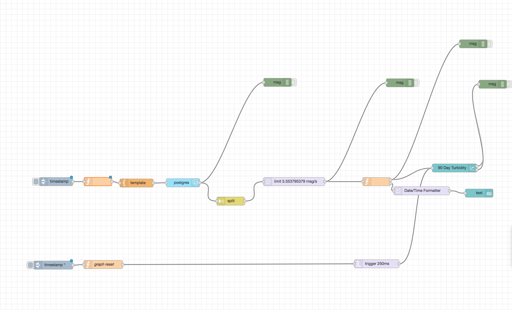
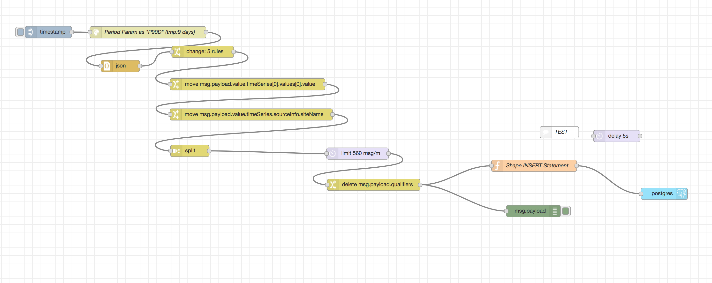
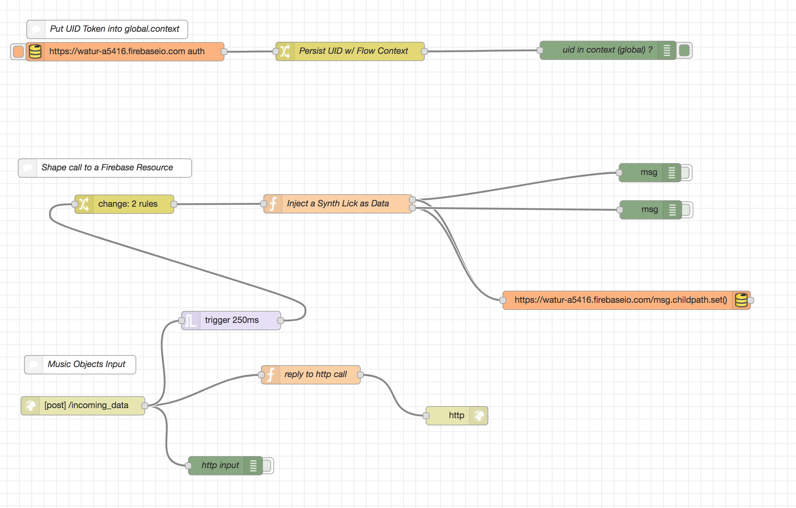
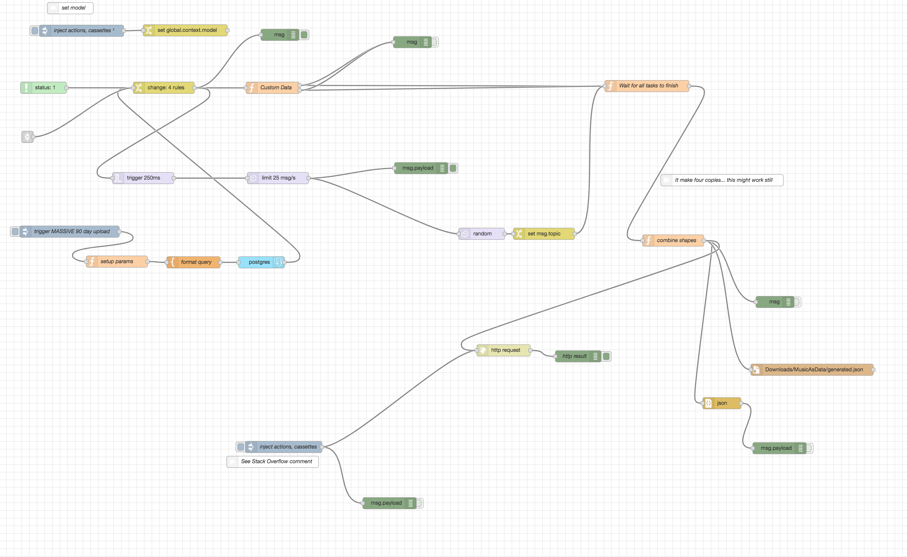

##Links

- https://github.com/renemarcelo/dot-node-red-saic-harris-art/blob/master/.start.backup (this is the code you can 'import' into node red via copy-paste)

- https://www.npmjs.com/package/node-red-contrib-moment

- https://www.npmjs.com/package/node-red-contrib-postgres

 One code schematic -- with the 90 Day output.

 Another one with the import into a postgres database.

 Also this one where data are sent to a synth (tuna.js I suppose) and recorded onto 'cassettes' which are replayable (at the height of project crunch-time).

 This is where I had most creative reign.  

## Final Recording
A baseline loop was used to provide aural 'stability' in the final recording:
- https://soundcloud.com/rene-on-iot/rene-marcelo-turbidity-iot

## Publications
- https://europepmc.org/articles/PMC5949598/figure/f9/
